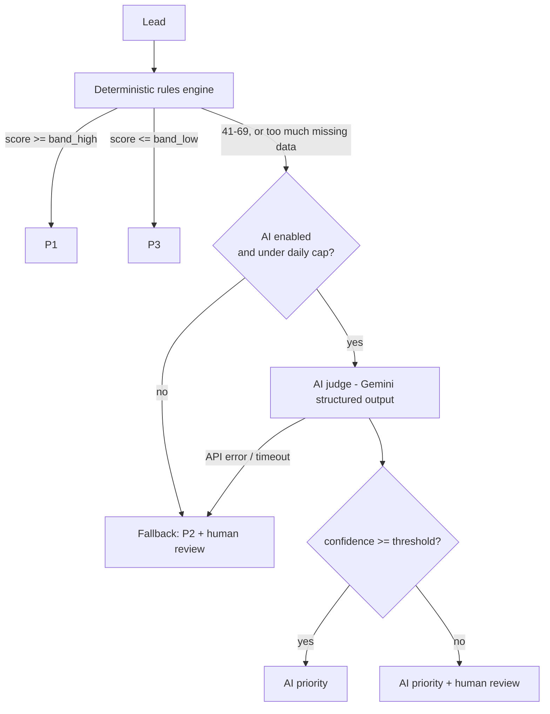

# Lead Triage Engine

Prioritizes leads (P1/P2/P3) and explains its reasoning. Deterministic rules handle the clear cases, an LLM handles only the ambiguous band, a human handles the doubtful ones — and every rule is changeable without a developer or a deploy.

Built as a portfolio piece for a **Product / technical BA** role. The point isn't the code — it's the product decisions: what the system is allowed to decide, where the AI is and isn't trusted, and how you know it works.

**Status: in progress.** The engine, the pipeline guardrails, the API, and the admin panel are built and tested (44 tests passing). Still pending — both blocked on things only Daniel can provide: the eval numbers below (needs a Gemini key from a GCP project not shared with his production systems, plus his hand-labels on the 30 golden leads), and the deploy + demo GIF.

## The problem

A business prioritizes leads on criteria that change often — ICP, urgency, channel, seasonality. Two common answers, both bad:

- **Hard-coded rules.** Every ICP tweak is a developer ticket and a deploy.
- **"Let the AI decide."** Nobody can explain why a given lead came out P1, which matters when the person acting on the queue is the business owner.

The middle answer, and this project's thesis:

> **Deterministic rules for the clear cases. AI only for the ambiguous band. A human for the doubtful ones. All of it changeable without a deploy.**

Concrete instance: triaging Power Flow's own outbound and inbound leads — P1 = contact today, P2 = this week, P3 = when there's time.

## Why hybrid, not pure ML

A trained model is the obvious "real" answer and it's the wrong one here:

- **No training data.** A new business doesn't have thousands of labeled historical leads. This system is what *generates* that dataset — every human override in the decisions log is a new label.
- **Explainability from day one.** Rules explain themselves; the LLM is prompted to return a business-language rationale with every call. A model would be a black box until it had enough data to audit, which is exactly when you least want one.
- **The trade-off, named:** the hybrid doesn't learn on its own. A human adjusts the rules when the ICP shifts. That's a feature for a business that wants to understand its own funnel, and a bug for one that wants to set it and forget it — this is the former.

## Architecture



Rules live in a Postgres table (`triage.rules`), not in code. The admin panel toggles them and edits their points with an htmx row swap — no reload, no deploy. Same for the bands, the confidence threshold, the daily AI cap, and the AI kill switch (`triage.settings`).

## Guardrails — what happens when the system is wrong

*(This table is the actual product. Full reasoning in [docs/PRD.md](docs/PRD.md) section 5.)*

| Failure mode | Mitigation |
|---|---|
| False P3 (good lead triaged too low) | The ambiguous band never resolves straight to P3 without high AI confidence — a low-confidence "looks like P3" goes to human review instead |
| Low-confidence AI decision | `confidence < 0.7` → flagged for human review, never silently trusted |
| Gemini API failure / timeout | Fail-safe, not fail-silent: `source='fallback'`, priority **P2**, human review — the exact pre-system state |
| Runaway AI cost | Hard daily cap on AI calls; once hit, ambiguous leads fall back to P2 + review for the rest of the day |
| Undebuggable decisions | Every decision — rules-only, AI-assisted, or fallback — logged to `triage.decisions` with rationale and matched rules. No exceptions. |

## Eval results

*Pending — needs the 30 golden leads in `eval/golden_leads.json` labeled by hand, and a Gemini key. Run `python eval/run_eval.py`; results and their honest reading land here.*

Three configurations get compared against the hand labels: rules-only (ambiguous → P2), rules + AI hybrid, and AI-only. Expected reading, to be confirmed by the real numbers: rules-only misses in the middle band, AI-only is expensive and less explainable, the hybrid wins. If the numbers say otherwise, this section reports that and the rules or the prompt get one iteration — not a touch-up.

## Cost

At ~100 leads/month with roughly 30% landing in the ambiguous band: ~30 Gemini `gemini-2.5-flash` calls/month, which is free tier. The daily cap in settings doubles as a cost ceiling if the system is ever pointed at a paid model.

## Running it

```bash
pip install -r requirements.txt
cp .env.example .env   # SUPABASE_URL, SUPABASE_SERVICE_KEY, GEMINI_API_KEY

psql "$SUPABASE_DB_URL" -f db/seed.sql   # schema + rules v1
uvicorn app.main:app --reload            # API + panel at /panel/rules

pytest                                   # 44 tests
```

## Structure

```
app/engine.py       deterministic scoring — pure function, no I/O, unit-tested
app/ai_judge.py     Gemini structured-output call for the ambiguous band only
app/pipeline.py     wires the two together with the guardrails above
app/db.py           all Supabase I/O, isolated so the rest stays testable
app/main.py         FastAPI API + Jinja2/htmx admin panel
db/seed.sql         schema (triage.rules / settings / decisions) + rules v1
eval/               30 golden leads + the 3-config eval harness
docs/PRD.md         problem, scope cut, rules v1, guardrails, success metrics
tests/              44 tests — engine, pipeline guardrails, API/panel
```
