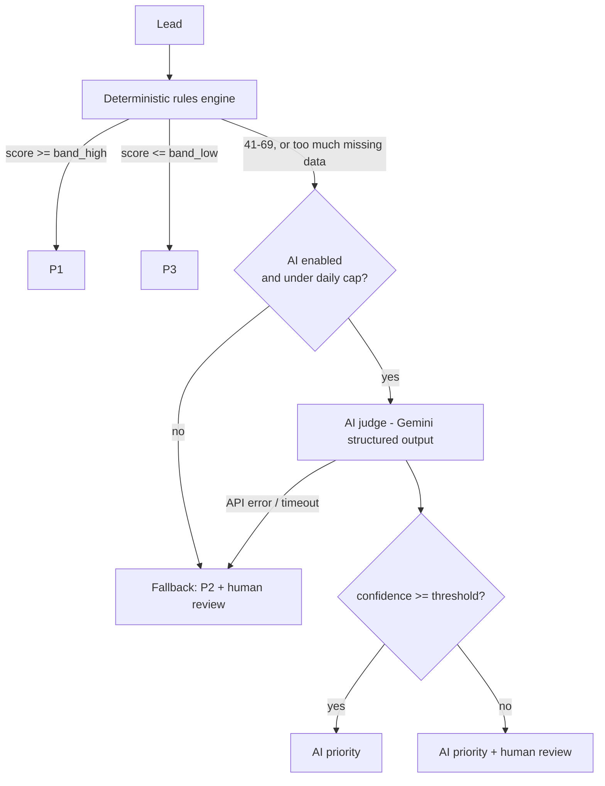

# Lead Triage Engine

Prioritizes leads (P1/P2/P3) and explains its reasoning. Deterministic rules handle the clear cases, an LLM handles only the ambiguous band, a human handles the doubtful ones — and every rule is changeable without a developer or a deploy.

Built as a portfolio piece for a **Product / technical BA** role. The point isn't the code — it's the product decisions: what the system is allowed to decide, where the AI is and isn't trusted, and how you know it works.

**Status: in progress.** The engine, the pipeline guardrails, the API, and the admin panel are built and tested (44 tests passing), verified live against a real Supabase + Gemini backend (2026-09-13), and the eval (below) has run for real against Daniel's own hand labels. Still pending: the deploy + demo GIF.

## The problem

A business prioritizes leads on criteria that change often — ICP, urgency, channel, seasonality. Two common answers, both bad:

- **Hard-coded rules.** Every ICP tweak is a developer ticket and a deploy.
- **"Let the AI decide."** Nobody can explain why a given lead came out P1, which matters when the person acting on the queue is the business owner.

The middle answer, and this project's thesis:

> **Deterministic rules for the clear cases. AI only for the ambiguous band. A human for the doubtful ones. All of it changeable without a deploy.**

Concrete instance: triaging Power Flow's own outbound and inbound leads — P1 = contact today, P2 = this week, P3 = when there's time.

## Why hybrid, not pure ML

A trained model is the obvious "real" answer and it's the wrong one here:

- **No training data.** A new business doesn't have thousands of labeled historical leads. This system is what *generates* that dataset — every human override in the decisions log is a new label.
- **Explainability from day one.** Rules explain themselves; the LLM is prompted to return a business-language rationale with every call. A model would be a black box until it had enough data to audit, which is exactly when you least want one.
- **The trade-off, named:** the hybrid doesn't learn on its own. A human adjusts the rules when the ICP shifts. That's a feature for a business that wants to understand its own funnel, and a bug for one that wants to set it and forget it — this is the former.

## Architecture



Rules live in a Postgres table (`triage.rules`), not in code. The admin panel toggles them and edits their points with an htmx row swap — no reload, no deploy. Same for the bands, the confidence threshold, the daily AI cap, and the AI kill switch (`triage.settings`).

## Guardrails — what happens when the system is wrong

*(This table is the actual product. Full reasoning in [docs/PRD.md](docs/PRD.md) section 5.)*

| Failure mode | Mitigation |
|---|---|
| False P3 (good lead triaged too low) | The ambiguous band never resolves straight to P3 without high AI confidence — a low-confidence "looks like P3" goes to human review instead |
| Low-confidence AI decision | `confidence < 0.7` → flagged for human review, never silently trusted |
| Gemini API failure / timeout | Fail-safe, not fail-silent: `source='fallback'`, priority **P2**, human review — the exact pre-system state |
| Runaway AI cost | Hard daily cap on AI calls; once hit, ambiguous leads fall back to P2 + review for the rest of the day |
| Undebuggable decisions | Every decision — rules-only, AI-assisted, or fallback — logged to `triage.decisions` with rationale and matched rules. No exceptions. |

## Eval results

Real run against Daniel's own hand labels on the 30 golden leads (`eval/golden_leads.json`), `python eval/run_eval.py`, 2026-09-13:

| Config | Exact match vs. Daniel's label | Severe miss (P1 called P3, or P3 called P1) |
|---|---|---|
| A — rules only (ambiguous defaults to P2) | 43.3% (13/30) | 6.7% (2/30) |
| B — rules + AI hybrid (the real pipeline) | 43.3% (13/30) | 20% (varied 2-6/11 ambiguous leads across repeat runs) |
| C — AI judges every lead, rules ignored | 40.0% (12/30) | — |

**The honest reading — not the one this project set out to find.** The working hypothesis (see the docstring in `eval/run_eval.py`) was that the hybrid would beat rules-only, since rules-only has no way to resolve the ambiguous band except a flat default. The real numbers say otherwise: adding the AI judge doesn't improve exact-match agreement at all, and roughly triples the *severe*-miss rate — cases where a genuinely hot lead gets called cold, or vice versa. Inspecting the two clearest severe misses (a 500+ employee company outside the ICP's sweet spot called P1 at 0.95 confidence; a lead that only weakly matched the target role called P1 at 0.85 confidence) shows the AI anchoring on one or two matching signals (right channel, plausible role) and overriding the size/fit signal that the rules already had right. Both were *above* the 0.7 confidence threshold that's supposed to route doubtful AI calls to human review — so the guardrail that exists specifically to catch low-confidence mistakes didn't catch either of these, because the model was confidently wrong, not uncertain.

**Why this is reported instead of iterated away.** The rules or prompt could get another pass to chase a better number, but with only 11 leads ever reaching the AI judge, one more iteration risks tuning the prompt to this specific 30-lead set rather than fixing anything real — and the finding itself is the more useful one for a product-decision-making role: it's evidence the system correctly identifies when adding an AI layer *isn't* worth it yet, rather than reaching for AI because it's available. The practical takeaway for Power Flow: the deterministic default (P2 + review) is currently the safer choice in the ambiguous band, and the AI judge's value today is more about writing an explainable rationale on the leads that do go to human review than about replacing that human's judgment.

## Cost

At ~100 leads/month with roughly 30% landing in the ambiguous band: ~30 Gemini `gemini-2.5-flash` calls/month, which is free tier at production pace. (Running the full 30-lead eval in one sitting is a burst of ~40 calls and does hit the free tier's 20-requests/day cap — billing was enabled on the eval's GCP project for that one-time run, at a cost of a few cents.) The daily cap in settings doubles as a cost ceiling if the system is ever pointed at a paid model.

## Running it

```bash
pip install -r requirements.txt
cp .env.example .env   # SUPABASE_URL, SUPABASE_SERVICE_KEY, GEMINI_API_KEY

psql "$SUPABASE_DB_URL" -f db/seed.sql   # schema + rules v1
uvicorn app.main:app --reload            # API + panel at /panel/rules

pytest                                   # 44 tests
```

## Structure

```
app/engine.py       deterministic scoring — pure function, no I/O, unit-tested
app/ai_judge.py     Gemini structured-output call for the ambiguous band only
app/pipeline.py     wires the two together with the guardrails above
app/db.py           all Supabase I/O, isolated so the rest stays testable
app/main.py         FastAPI API + Jinja2/htmx admin panel
db/seed.sql         schema (triage.rules / settings / decisions) + rules v1
eval/               30 golden leads + the 3-config eval harness
docs/PRD.md         problem, scope cut, rules v1, guardrails, success metrics
tests/              44 tests — engine, pipeline guardrails, API/panel
```
